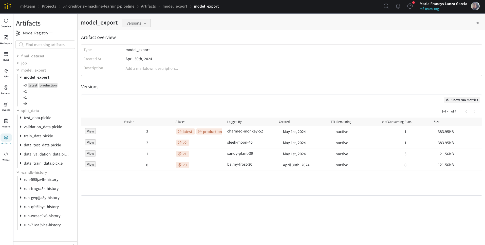

# Credit Default Risk Machine Learning Pipeline

## Project Overview

This project aims to develop a classifier model to estimate the likelihood of loan applicants repaying their loans on time. The classifier is designed to optimize the credit application process, benefiting both the client and the company by ensuring that viable applicants are approved while reducing the risk of non-payment by denying those less likely to repay.hich covers all the necessary steps to get a prediction from the data, from data processes to prediction acquisition. 

## Objectives
The main goal is to create a situation where:

- Applicants capable of repaying the loan are approved.
- The company minimizes financial losses from non-repayment.

## Approach and Methodology

To develop a robust model, the project was structured into several key phases:

1. Business Understanding: Define the project objectives from a business perspective, translate these into a data science framework, and outline the expected model outcomes.
2. Data Preparation and Understanding: Prepare and explore the dataset to understand the attributes and data structure. This includes cleaning data, handling missing values, and identifying potential predictors.
3. Feature Engineering: Develop and select features that are predictive of the loan repayment ability based on domain knowledge and exploratory data analysis.
4. Modeling:

   - Develop various classification models to predict the likelihood of repayment.
   - Employ techniques for feature selection and hyperparameter tuning to optimize the models.
5. Evaluation: Assess model performance using unseen data, focusing on metrics appropriate for classification problems like ROC AUC and Precision-Recall AUC.
6. Business Rule Definition: Use the model's scoring output to set decision thresholds that align with business objectives regarding risk tolerance and customer experience.

## Project Implementation

To ensure the model is scalable, reproducible, and easily maintainable, We implemented an ML pipeline that automates the journey from data processing to making predictions. This pipeline encapsulates all the steps necessary to prepare the data, execute the model, and generate predictions, facilitating both deployment and future adjustments.

### How to Install ML Pipeline

To set up and run the credit risk machine learning pipeline on your local machine, follow these steps:

Create a Conda Environment:
Ensure you have Conda installed on your system. Create a new Conda environment using the following command:

`
conda create -n myenv-credit-risk-machine-learning-pipeline python=3.12.1
`

`
conda activate myenv-credit-risk-machine-learning-pipeline
`

`
pip install -r requirements.txt
`

`
pip install -e .
`

### Using the Pipeline with MLflow and Weights & Biases
You can run the pipeline using MLflow. To do this, use the following command:
'
mlflow run -v 1.0.0 [URL of your Github repo]
'

Note: Ensure you are logged in to Weights & Biases for tracking experiments

### Dependencies:

Python Version: 3.12.1

### Tracking, Reproducibility, and Deployment project

To track, reproduce, and deploy the machine learning models effectively, we utilize MLflow and Weights & Biases. By integrating these tools into our pipeline, we enhance the transparency and reproducibility of our model development efforts. This integration allows us to maintain a robust framework for experiment management and model tracking, enabling us to consistently achieve and improve our model performance metrics.

## Evaluation Metrics

- ROC AUC: A primary metric for evaluating the model’s ability to distinguish between the classes effectively.
- Precision-Recall AUC (PR AUC): Given the class imbalance observed with a higher number of non-repaid loans, PR AUC provides a robust measure to evaluate model performance in such scenarios.
- Kolmogorov-Smirnov Statistic (KS): This statistic is used to measure the degree of separation between the distributions of the model's scores for the positive and negative classes. 

## Description of the project notebooks.

### 0.0.0. Business understanding
The objective variable of this problem is to estimate the probability that the applicants can pay the loan on time. To address this problem, I built a binary classification model. I used a sample of requests associated with their respective label indicating whether the loan was repaid or the loan was not repaid. In addition, I used a subset of information on the characteristics of the requested credit and the client, such as their historical credit behavior. Finally, I used the predicted score for each application that the model returns to make decisions.
To define how this probability will be used is necessary to determine the business objectives:
* Option 1: We want business rules focused on maximizing the ability to identify bad applicants. But the number of mislabels on good applicants increases (false negative rate). With this approach, we would minimize the credit risk but increase the users' friction by rejecting that they can pay the loan.

* Option 2: We want a business rule where we would minimize the number of mislabels on good applicants (false positive rate). But the ability to identify bad applicants decreases. With this approach, we would minimize the users' friction but increase the credit risk by approving that they cannot pay the loan.

On the other hand, to choose the structure of the model and evaluate its performance, We sought to maximize the ROC AUC. This metric is more related to the evaluation of classifiers based on their efficiency for class separation. We can isolate the modeling process by maximizing accuracy and recovery metrics for different probability thresholds and use score for decision-making. With this, we can choose the threshold that best suits the needs of the business to define whether an application is highly successful or not.

Additionally, one of the characteristics of this problem is the not repaid loan sample is much higher than the repaid loan sample. Therefore, We also evaluated the Precision-Recall AUC (PR AUC), which is a more robust metric to evaluate a classifier in these situations to deal with class imbalance.

### [1.0.0 Build inputs from Previous Internal Applications](https://github.com/MFrancys/credit-risk-machine-learning-pipeline-/blob/build-risk-ml-pipeline/notebook/1.0.0_build_inputs_from_previous_internal_applications.ipynb)
#### - Methodology
This section aims to create informative and meaningful features that capture customers' past interactions with credit products, particularly their Buy Now, Pay Later (BNPL) applications and SF applications. 

Here are some features we explored: 
- Raw Features:
  - Account to Application Days (previous_internal_apps__account_to_application_days): This directly captures the duration from account creation to loan application, providing insights into the customer’s planning or urgency in financial matters.
  - Number of Smartphone Financing Applications (previous_internal_apps__n_sf_apps): Reflects the customer's interest in financing options specifically for smartphones, which can be indicative of their spending habits and preferences.
  - Total BNPL Applications and Approvals:
    - Applications (previous_internal_apps__n_bnpl_apps): Total number of BNPL applications made.
    - Approvals (previous_internal_apps__n_bnpl_approved_apps): Number of BNPL applications that were approved.
  - Credit Inquiries:
    - Last 3 Months (previous_internal_apps__n_inquiries_l3m): Inquiries in the last 3 months.
    - Last 6 Months (previous_internal_apps__n_inquiries_l6m): Inquiries in the last 6 months.

- Derived Features:  
  - BNPL Approval Ratio (previous_internal_apps__ratio_bnpl_approved): The ratio of approved BNPL applications to the total number of BNPL applications (n_bnpl_approved_apps / n_bnpl_apps).
  - Days from Last BNPL Application to Loan Application (previous_internal_apps__last_bnpl_app_to_application_days): The number of days between the date of the last BNPL application and the date of the current loan application (application_datetime - last_bnpl_app_date).
  - Days from First BNPL Application to Loan Application (previous_internal_apps__first_bnpl_app_to_application_days): The number of days between the date of the first BNPL application and the date of the current loan application (application_datetime - first_bnpl_app_date).

### [1.1.0 Build inputs from credit reports dataset](https://github.com/MFrancys/credit-risk-machine-learning-pipeline-/blob/build-risk-ml-pipeline/notebook/1.1.0_build_inputs_from_credit_reports_dataset.ipynb) 

#### - Methodology
The goal of this section is to construct informative and actionable features from the credit reports dataset that encapsulate each customer's credit history effectively. This involves a meticulous aggregation and transformation of credit-related data

Here are some features we explored, overall and by credit time: 
- Raw Features:
    - Total Loans Count (credit_reports__loans_count): Captures the total number of loans associated with each customer, providing a direct measure of credit usage.
    - Maximum Credit Used (credit_reports__max_credit_max): Represents the peak credit amount utilized by the customer, indicating their highest financial leverage or needs.
- Derived Features:
    - Credit Utilization Ratios (credit_reports__debt_ratio): Calculated as the ratio of current balance to credit limit, this metric helps in assessing how much of the available credit is being utilized by the customer.
    - Delayed Payment Indicators (credit_reports__has_delayed_payments): Reflects whether there have been any payments past their due date, which is a critical indicator of potential default risk.
    - Diversity in Credit Types (credit_reports__credit_type_nunique): The count of unique types of credit, which illustrates the variety of credit facilities used by the customer.
    - Age of Credit (credit_reports__age): Measures the duration from the opening to the closing of the credit or to the current date if it's still active, providing insights into the longevity of credit relationships.

### [1.2.0 Build Final Dataset](https://github.com/MFrancys/credit-risk-machine-learning-pipeline-/blob/build-risk-ml-pipeline/notebook/1.2.0_build_final_dataset.ipynb)

#### Methodology:
The main goal of this stage is to compile the final dataset that merges the target variable with features generated from previous steps, specifically those created by build_previous_internal_app_features and build_aggregate_credit_report_information_by. This comprehensive dataset will be the foundation for all subsequent modeling efforts, such as training and validation of machine learning models to predict customer creditworthiness.

Data Integration:
1. Merge Target Data: Start by merging the dataset containing the target variable (e.g., loan default status) with features derived from the build_previous_internal_app_features function, which provides insights into the customer's past interactions with credit products.
2. Add Aggregated Credit Information: Integrate additional features from the build_aggregate_credit_report_information_by function. This includes detailed credit behavior metrics at the customer level, further enriching the dataset.

### [1.3.0 Target Analysis](https://github.com/MFrancys/credit-risk-machine-learning-pipeline-/blob/init-ml-pipeline/notebook/1.3.0_target_analysis.ipynb)

#### Methodology
This section of the analysis focuses on examining the target variable, which identifies whether a loan is bad (i.e., the customer was 34 days late or more in 77 days of contract). Understanding patterns in the bad rate is crucial for assessing risk and calibrating the model accordingly.
1. Overall Bad Rate: Calculate the overall default rate by dividing the sum of defaulted loans by the total number of loans.
    Results: Based on the data provided:
    - Total Loans: 14,454
    - Total Defaults: 2,700
    - Overall Default Rate: 18.68%

2. Bad Rate Analysis by Loan Origination Month: To determine how the bad rate varies by the month the loan was originated.
   - Data Segmentation: Group the dataset by the loan_origination_datetime_month to analyze loans based on the month they were disbursed.
   - Rate Calculation: For each group, calculate the total number of loans (LOANS), the number of bad loans (BAD_LOANS), and the bad rate (BAD_RATE as the ratio of BAD_LOANS to LOANS).

3. Bad Rate Analysis by Credit Experience: This study analyzes the default rates among different segments of customers based on their credit experience (customers with no credit history, with less credit experience, and with high credit experience).
   - Customer Segmentation: Classify customers into categories based on their credit experience. The criteria for segmentation (e.g., number of prior loans, credit age) should be clearly defined.
   - Rate Calculation: Calculate the default rate for each category to identify which segment poses higher risks.

#### Conclusions
- Insights from Loan Origination Month Analysis
    - Trends Observed:
        - The bad rate tends to increase as the year progresses, peaking in early 2023 before showing a variable trend.
        - Notable peaks are observed in October 2022, December 2022, and January 2023, suggesting potential seasonality or economic factors impacting default rates (e.g. Buen Fin, Christmas).
    
        
      
- Insights from Credit Experience Analysis
    - It is hypothesized that customers with no or limited credit history might exhibit higher default rates due to unproven creditworthiness. Conversely, those with extensive credit history might show lower default rates if they have a history of good credit management.

    Below is a table showing the number of loans, bad loans, and the bad rate segmented by the count range of credit reports:
    
    | credit_reports__loans_count_range | LOANS | BAD_LOANS | BAD_RATE |
    |-----------------------------------|-------|-----------|----------|
    | (-1, 0]                           | 5282  | 982       | 0.185914 |
    | (0, 5]                            | 983   | 183       | 0.186165 |
    | (5, 10]                           | 1292  | 260       | 0.201238 |
    | (10, 15]                          | 1100  | 233       | 0.211818 |
    | (15, 30]                          | 2433  | 493       | 0.202630 |
    | (30, 300]                         | 3364  | 549       | 0.163199 |

### [2.0.0 - Data Split](https://github.com/MFrancys/credit-risk-machine-learning-pipeline-/blob/init-ml-pipeline/notebook/2.0.0_split_dataset.ipynb)

#### Methodology

This section details the process of splitting the dataset into training, validation, and testing sets. The dataset was split using a time-based strategy to segregate the data into distinct periods for training, validation, and testing. Furthermore, a spatial segregation approach was employed within the training data to create a validation set.

#### Conclusion:

- Data Split

    - Training Set: Data from July 2022 to February 2023, used for initial model training.
    - Validation Set: A subset of the training set, spatially distinct, used for tuning model parameters and initial evaluation.
    - Testing Set: Data from March 2023 to April 2024, used to simulate model performance on future, unseen data.
- Data Distribution 
    - The split resulted in the following distribution of samples:
    - Training Set: 9479 samples with a default rate (bads) of 19.4%.
    - Validation Set: 1053 samples with a default rate of 19.94%.
    - Testing Set: 3845 samples with a default rate of 16.9%. 
    
  This distribution ensures that each set is representative of the overall data, with the training set encompassing the majority of the data (65.59%), followed by the testing set (26.7%) and the validation set (7.3%).

| Split      | n_samples | bads | Start Date | End Date | Target Distribution | Samples Distribution |
|------------|-----------|------|------------|----------|---------------------|----------------------|
| Train      | 9479      | 1839 | 2022-07    | 2023-02  | 0.194008            | 0.659317             |
| Validation | 1053      | 210  | 2022-07    | 2023-02  | 0.199430            | 0.073242             |
| Test       | 3845      | 650  | 2023-03    | 2023-04  | 0.169051            | 0.267441             |

### [3.0.0. EDA](https://github.com/MFrancys/credit-risk-machine-learning-pipeline-/blob/init-ml-pipeline/notebook/3.0.0_eda.ipynb)

#### Methodology

As part of our data preparation and understanding phase, we conducted an extensive exploratory data analysis on the training dataset using the `pandas_profiling` package. This tool enables an automated and comprehensive EDA, generating a detailed report that includes:

- Statistics: Descriptive statistics that summarize a dataset's distribution's central tendency, dispersion, and shape.
- Correlations: Analysis of the relationships between features, identifying which pairs have the strongest correlations with the target variable.
- Missing Values: Identifying and visualizing missing data patterns, helping to decide necessary preprocessing steps.
- Distributions: Visualizations of data distributions and variance to understand the skewness and outliers that might influence model performance.

### [3.1.0. EDA: Identify Features with High Correlation](https://github.com/MFrancys/credit-risk-machine-learning-pipeline-/blob/init-ml-pipeline/notebook/3.1.0_eda_high_correlation_variables.ipynb)

#### Methodology

This step in exploratory data analysis (EDA) aims to identify and exclude features from the dataset that exhibit high correlation, specifically those with a correlation coefficient greater than 0.80. This process helps reduce multicollinearity, which can adversely affect the performance of many machine learning models by making the model parameters difficult to interpret and unstable.

Approach:
- Calculate the Pearson correlation matrix for all numeric features in the dataset. 
- Identify Highly Correlated Pairs: Using the function identify_high_correlation(data, threshold=0.9), identify all pairs of features whose absolute correlation exceeds the threshold of 0.80. This step effectively pinpoints potentially redundant features or have similar information content.
- Feature Selection: Review the list of highly correlated feature pairs. Decide which feature from each pair to retain based on:
    Importance in Modeling: Prefer features that are known to have a strong impact or relevance based on domain knowledge or previous modeling experiences.
    Data Quality: Retain features with fewer missing values or less noise.
    Business Relevance: Consider business understanding or input on which features are more interpretable or valuable for decision-making processes.

#### Conclusion
- Initial Feature Count: Begin with an initial set of 262 features.
- Feature Exclusion: After applying the correlation threshold, identify 109 features that are highly correlated with others. From each correlated pair or group, choose to drop the feature that is less significant from a business or data quality perspective, retaining 153 features for further analysis.

### 4.0.0. Building a Baseline Classifier Model

#### Methodology

In this section, we trained three different baseline classifier models to handle a imbalance dataset, with presence of null values, and nonlinear relationships among features. The models selected for this initial analysis were Logistic Regression, LightGBM (LGBM), and XGBoost (XGBM), because:
1. Logistic Regression

   Logistic regression is a linear model that estimates probabilities using a logistic function. 
    - Pros:
        - Simplicity and Interpretability: Easy to implement and results are interpretable.
        - Efficient Training: Less computationally intensive compared to tree-based models.
    - Cons:
        - Handling of Non-Linear Features: Performs poorly if relationships between features and the target are non-linear unless extensive feature engineering is done.
        - Requirement for Feature Scaling: Logistic regression requires feature scaling to perform well, as it is sensitive to the magnitude of input features.
        - Cannot Handle Missing Values Directly: Requires complete data or imputation of missing values before training.
        
2. LightGBM (LGBM)

    LightGBM is a gradient boosting framework that uses tree-based learning algorithms.
    - Pros:
        - Scalability: Works well with large datasets and supports GPU learning.
        - Performance: Generally provides high performance, especially on datasets where the relationship between variables is complex and non-linear.
        - Efficiency with Large Datasets: Optimized to run faster and use less memory compared to other gradient boosting frameworks.
        - Handling of Missing Values: Natively handles missing values without requiring imputation.
        - Robust to Feature Scaling: Automatically handles varying scales of data, making it less sensitive to the need for feature normalization.
    - Cons:
        - Overfitting: Prone to overfitting, especially with small data sets.
        - Parameter Tuning: Requires careful tuning of parameters and sometimes extensive hyperparameter optimization.

3. XGBoost (XGBM)

   XGBoost also uses gradient boosting algorithms but is known for its ability to do parallel processing, tree pruning, handling missing values, and regularizing to avoid overfitting.
    - Pros
        - Handling Irregularities: Good at handling missing values and various data irregularities.
        - Model Strength: Regularization helps to prevent overfitting and provides robust performance across various types of data.
    
    - Cons
        - Computational Intensity: Can be resource-intensive in terms of computation, especially with large data sets and a deep number of trees.
        - Complexity: More parameters to tune compared to other models, which can make it harder to find the right model configuration.

These are the parameters tailored for each models:
1. Logistic Regression Parameters:
    - Penalty: 'l2' (L2 regularization to prevent overfitting)
    - C: 1.0 (Regularization strength; smaller values specify stronger regularization)
2. LightGBM Parameters:
    - objective: "binary"         (Use binary classification since you mentioned imbalance assuming a binary target)
    - boosting_type: "gbdt"       (Gradient Boosting Decision Tree)
    - metric: "auc"               (Area Under the ROC Curve as a performance metric)
    - num_leaves: 31              (Maximum tree leaves for base learners)
    - learning_rate: 0.05         (Low learning rate to improve model robustness)
    - feature_fraction: 0.8       (LightGBM will randomly select 80% of features before building each tree)
    - bagging_fraction: 0.8       (Bagging (subsampling) fraction of the data for training)
    - bagging_freq: 5             (Perform bagging every 5 iterations)
    - is_unbalance: True          (Automatically adjust weights inversely proportional to class frequencies)
3. XGBoost Parameters:
    - objective: binary:logistic    (Objective function for binary classification)
    - booster: gbtree               (Use tree-based models as base learners)
    - eval_metric: auc              (Evaluation metric for validation data AUC is suitable for imbalanced data)
    - eta: 0.01                     (Learning rate lower to make training more robust)
    - gamma: 0.1                    (Minimum loss reduction required to make a further partition on a leaf node)
    - max_depth: 6                  (Maximum depth of a tree increasing this value will make the model more complex)
    - min_child_weight: 3           (Minimum sum of instance weight (hessian) needed in a child)
    - subsample: 0.8                (Subsample ratio of the training instance)
    - colsample_bytree: 0.8         (Subsample ratio of columns when constructing each tree)
    - scale_pos_weight: 4           (Balancing of positive and negative weights)
    - lambda: 1                     (L2 regularization term on weights increases with more features to combat overfitting)
    - alpha: 0.1                    (L1 regularization term on weights)
    - max_delta_step: 1             (Helps convergence in logistic regression problems when class is extremely imbalanced)
    - n_estimators: 100             (Number of trees. You can set this number high and use early stopping during training)

We evaluated the models using ROC AUC Score, PR AUC Score, and the Kolmogorov-Smirnov (KS) statistic to gauge their ability to distinguish between classes and predict the minority class in an unbalanced dataset.

### Conclusion
The following results were observed across the models, showing the pros and cons of each model:

| Model                | ROC AUC Score | PR AUC Score | KS Statistic | Handles Nulls | Sensitive to Scale | Overfitting Risk | Computational Intensity |
|----------------------|---------------|--------------|--------------|---------------|--------------------|------------------|-------------------------|
| Logistic Regression  | 0.499407     | 0.19943      | 0.001186    | No            | Yes                | Low              | Low                     |
| LightGBM (LGBM)      | 0.573764      | 0.246792   | 0.155211     | Yes           | No                 | Medium           | Medium                  |
| XGBoost (XGBM)       | 0.599619    | 0.269709     | 0.20405     | Yes           | No                 | High             | High                    |

Based on the evaluation metrics, XGBM outperforms the other models with the highest ROC AUC, PR AUC, and KS scores, making it the most suitable choice given the complexity of the dataset with unbalanced data and non-linear relationships.

### [5.0.0. Classifier Model with Feature Selection](https://github.com/MFrancys/credit-risk-machine-learning-pipeline-/blob/init-ml-pipeline/notebook/5.0.0_classifier_model_with_feature_selection-Copy1.ipynb)

#### Methodology

In our modeling phase, we implemented feature selection using the Boruta algorithm to identify the most relevant features for our classifier model. Boruta is a feature ranking and selection algorithm based on random forests. The algorithm iteratively removes less relevant features, ensuring that only the most statistically significant features are retained.

### Conclusion

- Significant Reduction in Features: From the original 142 features, Boruta reduced the feature set to the 20 most relevant features. This substantial reduction helps in alleviating the curse of dimensionality and improves model interpretability.'previous_internal_apps__account_to_application_days',
     - 'previous_internal_apps__n_bnpl_approved_apps'
     - 'previous_internal_apps__n_sf_apps'
     - 'previous_internal_apps__ratio_bnpl_approved'
     - 'credit_reports__balance_due_ratio_median'
     - 'credit_reports__balance_due_std_revolvente'
     - 'credit_reports__balance_due_worst_delay_ratio_median_pagos_fijos'
     - 'credit_reports__cdc_inquiry_id_count_por_determinar'
     - 'credit_reports__credit_limit_median_revolvente'
     - 'credit_reports__debt_ratio_median_pagos_fijos'
     - 'credit_reports__loans_with_at_least_one_delayed_ratio'
     - 'credit_reports__severity_delayed_payments_median'
     - 'credit_reports__severity_delayed_payments_median_pagos_fijos'
     - 'credit_reports__severity_delayed_payments_median_revolvente'

### [6.0.0 Hyperparameter Optimization for Classifier Model](https://github.com/MFrancys/credit-risk-machine-learning-pipeline-/blob/init-ml-pipeline/notebook/6.0.0_hyperparameter_optimization_for_classifier_model.ipynb)

#### Methodology

The primary goal is to tune the XGBOOST parameters:

    - eta (learning rate): Extended to explore more conservative and slightly more aggressive learning rates.
    - gamma: Now starts at 0 up to 1 to explore the impact of making trees more conservative.
    - max_depth: Increased the upper limit to allow deeper trees which might capture more complex patterns.
    - min_child_weight: Broader range to better control overfitting by requiring nodes to justify splits with more samples.
    - subsample and colsample_bytree: Allowed to vary more widely to assess different levels of data and feature subsampling.
    - scale_pos_weight: Adjusted to better balance the classes given the known imbalance.
    - lambda and alpha: Expanded the range for regularization parameters to further control overfitting.
    - max_delta_step: Introduced a broader range to help stabilize updates in scenarios of high class imbalance.
    - n_estimators: Increased the maximum to allow more trees to be evaluated, which can be crucial when all other parameters are being optimized for better granularity.

### [7.0.0 Building a Final Classifier Model](https://github.com/MFrancys/credit-risk-machine-learning-pipeline-/blob/init-ml-pipeline/notebook/7.0.0_build_final_classifier_model.ipynb)

#### Methodology

The modeling process culminates in constructing the final classifier model using XGBoost. The final model incorporates a set of finely tuned parameters to optimize performance, mainly focusing on handling the dataset's imbalanced nature. The parameters were selected based on previous optimization efforts, ensuring the model is robust, generalizes well on unseen data, and maximizes the AUC metric.

Final Model Parameters:

    - 'objective': 'binary:logistic'
    - 'booster': 'gbtree'
    - 'eval_metric': 'auc'
    - 'eta': 0.01
    - 'gamma': 0.1
    - 'max_depth': 6
    - 'min_child_weight': 3
    - 'subsample': 0.8
    - 'colsample_bytree': 0.8
    - 'scale_pos_weight': 4
    - 'lambda': 1
    - 'alpha': 0.1
    - 'max_delta_step': 1
    - 'n_estimators': 100

Final Features: 

    - 'previous_internal_apps__account_to_application_days'
    - 'previous_internal_apps__n_bnpl_approved_apps'
    - 'previous_internal_apps__n_sf_apps'
    - 'previous_internal_apps__ratio_bnpl_approved'
    - 'credit_reports__balance_due_ratio_median'
    - 'credit_reports__balance_due_std_revolvente'
    - 'credit_reports__balance_due_worst_delay_ratio_median_pagos_fijos'
    - 'credit_reports__cdc_inquiry_id_count_por_determinar'
    - 'credit_reports__credit_limit_median_revolvente'
    - 'credit_reports__debt_ratio_median_pagos_fijos'
    - 'credit_reports__loans_with_at_least_one_delayed_ratio'
    - 'credit_reports__severity_delayed_payments_median'
    - 'credit_reports__severity_delayed_payments_median_pagos_fijos'
    - 'credit_reports__severity_delayed_payments_median_revolvente'

#### Conclusion
The final model demonstrated a decent level of predictive performance, as evidenced by the key metrics:

- **ROC AUC Score:** 0.6111
- **Precision-Recall AUC:** 0.2832
- **Kolmogorov-Smirnov Statistic:** 0.1780

These results indicate the model's effectiveness in discriminating between positive and negative classes despite the inherent challenges posed by the imbalanced dataset. The ROC AUC score highlights the model's capability to separate classes at various threshold settings. However, the Precision-Recall AUC, particularly critical in the context of imbalanced datasets, suggests room for improvement, especially in capturing the minority class effectively.

**Future Work:**
- Further tuning of hyperparameters might yield better performance, particularly in improving the Precision-Recall AUC.
- Incorporating additional features or exploring more advanced feature engineering techniques could also enhance the model's ability to capture complex patterns.
- Experimentation with different model architectures or ensemble methods could improve overall accuracy and stability.

These steps will help refine the model to meet better the business goals of reducing credit risk while ensuring fair and efficient loan approval processes.

# [8.0.0 Evaluate Final Classifier Model](https://github.com/MFrancys/credit-risk-machine-learning-pipeline-/blob/init-ml-pipeline/notebook/8.0.0_evaluate_final_classifier_model.ipynb)

### Performance Evaluation

The final classifier model was assessed on unseen test data to gauge its real-world applicability and robustness. We got the following results:

**Overall Performance on Test Data:**
- **ROC AUC Score:** 0.5634

    
- **Precision-Recall AUC:** 0.1989
- **Kolmogorov-Smirnov Statistic:** 0.1011

- Performance Over Time:

| Month    | ROC AUC Score | PR AUC   | KS       |
|----------|---------------|----------|----------|
| 2023-03  | 0.5607        | 0.2121   | 0.1009   |
| 2023-04  | 0.5666        | 0.1863   | 0.1218   |

- Performance by Loan Count Range:

| Loan Count Range | ROC AUC Score | PR AUC   | KS       |
|------------------|---------------|----------|----------|
| (-1, 0]          | 0.5013        | 0.1693   | 0.0192   |
| (0, 5]           | 0.5935        | 0.2380   | 0.1808   |
| (5, 300]         | 0.5956        | 0.2202   | 0.1531   |

### SHAP Value Analysis

SHAP values were analyzed to understand the impact of various features on the model's predictions. These values highlight how each feature contributes to pushing the model output from the base value (the output that would be predicted if we did not know any features for the current output) to the actual model output.

- Top Impactful Features (SHAP Values)

 

### Conclusion

The evaluation of the final model shows moderate performance with room for improvement, especially in handling minority class predictions effectively as indicated by the PR AUC scores. The time-wise and loan count-wise performance breakdown provides insights into model stability across different temporal segments and customer segments. The SHAP analysis offers valuable explanations which can help in further tuning and trust-building for model decisions.

Future efforts will focus on enhancing model accuracy and robustness through advanced feature engineering, hyperparameter optimization, and possibly integrating additional data sources to enrich the model's understanding of the applicant's financial behavior.

### [8.1.0. Score Band Analysis](https://github.com/MFrancys/credit-risk-machine-learning-pipeline-/blob/init-ml-pipeline/notebook/8.1.0_score_band_analysis.ipynb)

#### Overview
This section presents the analysis of score bands derived from the final model. Score bands help to segment the population based on the risk of default. The segments are created using the score predicted by the model, allowing us to observe the distribution of bad and good loans across different score ranges.

The Score Band Analysis provides valuable insights into the model's performance across different risk segments. It helps in understanding the model's discrimination ability across various thresholds and is crucial for setting appropriate cut-offs based on the company’s risk appetite.

 Bucket | Score Min | Score Max | Clients | Bads | Goods | Bad Rate (%) | Good Rate (%) | Cumulative Bad Rate (%) | Cumulative Good Rate (%) | KS    |
|--------|-----------|-----------|---------|------|-------|--------------|---------------|-------------------------|--------------------------|-------|
| 0      | 0.0       | 0.309     | 376     | 35   | 341   | 5.385        | 10.673        | 5.385                   | 10.673                   | 5.288 |
| 1      | 0.381     | 0.415     | 393     | 51   | 342   | 7.846        | 10.704        | 13.231                  | 21.377                   | 8.146 |
| 2      | 0.415     | 0.440     | 383     | 61   | 322   | 9.385        | 10.078        | 22.616                  | 31.455                   | 8.839 |
| 3      | 0.440     | 0.460     | 386     | 67   | 319   | 10.308       | 9.984         | 32.924                  | 41.439                   | 8.515 |
| 4      | 0.460     | 0.481     | 384     | 67   | 317   | 10.308       | 9.922         | 43.232                  | 51.361                   | 8.129 |
| 5      | 0.481     | 0.506     | 385     | 75   | 310   | 11.538       | 9.703         | 54.770                  | 61.064                   | 6.294 |
| 6      | 0.506     | 0.514     | 74      | 13   | 61    | 2.000        | 1.909         | 56.770                  | 62.973                   | 6.203 |
| 7      | 0.514     | 0.534     | 1079    | 192  | 887   | 29.538       | 27.762        | 86.308                  | 90.735                   | 4.427 |
| 8      | 0.534     | 0.649     | 385     | 89   | 296   | 13.692       | 9.264         | 100.000                 | 99.999                   | -0.001 |

#### Loans Count = 0

| Bucket | Score Min | Score Max | Clients | Bads | Goods | Bads Rate | Goods Rate | Cum Bads Rate | Cum Goods Rate | KS   |
|--------|-----------|-----------|---------|------|-------|-----------|------------|---------------|----------------|------|
| 0      | 0.327     | 0.459     | 248     | 39.0 | 209   | 18.66     | 20.311     | 18.66         | 20.311         | 1.651|
| 1      | 0.460     | 0.514     | 990     | 170.0| 820   | 81.34     | 79.689     | 100.00        | 100.000        | 0.000|

#### Loans Count > 0
| Bucket | Score Min | Score Max | Clients | Bads | Goods | Bads Rate | Goods Rate | Cum Bads Rate | Cum Goods Rate | KS    |
|--------|-----------|-----------|---------|------|-------|-----------|------------|---------------|----------------|-------|
| 0      | 0.309     | 0.377     | 261     | 16.0 | 245   | 3.628     | 11.311     | 3.628         | 11.311         | 7.683 |
| 1      | 0.377     | 0.408     | 261     | 36.0 | 225   | 8.163     | 10.388     | 11.791        | 21.699         | 9.908 |
| 2      | 0.408     | 0.431     | 260     | 34.0 | 226   | 7.710     | 10.434     | 19.501        | 32.133         | 12.632|
| 3      | 0.431     | 0.444     | 261     | 46.0 | 215   | 10.431    | 9.926      | 29.932        | 42.059         | 12.127|
| 4      | 0.444     | 0.461     | 260     | 45.0 | 215   | 10.204    | 9.926      | 40.136        | 51.985         | 11.849|
| 5      | 0.461     | 0.477     | 261     | 46.0 | 215   | 10.431    | 9.926      | 50.567        | 61.911         | 11.344|
| 6      | 0.477     | 0.492     | 261     | 49.0 | 212   | 11.111    | 9.788      | 61.678        | 71.699         | 10.021|
| 7      | 0.492     | 0.515     | 260     | 48.0 | 212   | 10.884    | 9.788      | 72.562        | 81.487         | 8.925 |
| 8      | 0.515     | 0.553     | 261     | 57.0 | 204   | 12.925    | 9.418      | 85.487        | 90.905         | 5.418 |
| 9      | 0.554     | 0.649     | 261     | 64.0 | 197   | 14.512    | 9.095      | 99.999        | 100.000        | 0.001 |

## Future Work

As we continue to refine and evolve the model, our focus will remain on improving both its accuracy and robustness, ensuring that it aligns with business objectives while managing credit risk effectively. The following are key areas where future efforts will be concentrated:

- Expanding Data Sources for Underrepresented Groups: The model currently shows limited performance in predicting outcomes for clients without extensive credit history. To address this, we can explore non-traditional data sources such as device information, social network analysis, and digital footprints. These sources could provide valuable insights into a user’s behavior and reliability, enhancing our ability to assess risk accurately for new or underserved customer segments.
- Integration of Fraud Detection Techniques: Incorporating elements of fraud detection, like validating email addresses and analyzing digital behavior, can help in assessing the integrity of applications, thus reducing both credit and fraud risk.
These initiatives will not only help in optimizing the model but also ensure that it remains adaptable to changing market conditions and customer behaviors. The goal is to create a fair, efficient, and effective loan approval process that supports the company's growth and customer satisfaction.
- Hyperparameter Optimization: Ongoing tuning of hyperparameters may lead to better performance, with a special emphasis on enhancing the Precision-Recall AUC which is crucial for managing the balance between recognizing genuine applicants and minimizing false positives.
- Advanced Feature Engineering: By incorporating additional data sources and exploring advanced feature engineering techniques, we can further improve the model's ability to identify complex behavioral patterns that may indicate credit risk.

